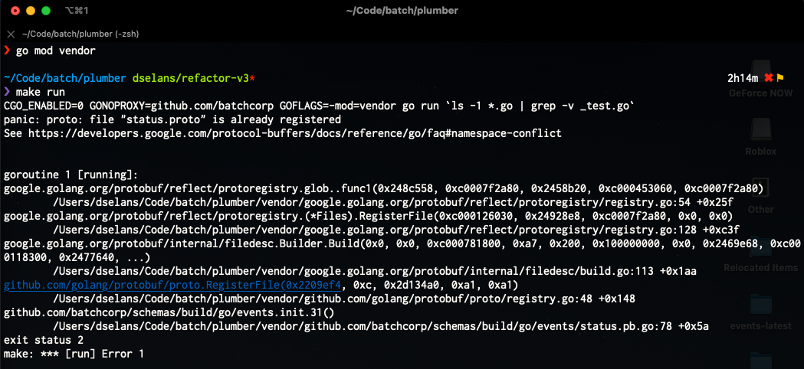

plumber-schemas
===============

This repo contains protobuf schemas that are used by `plumber`.

# IMPORTANT

The proto schemas are used to generate CLI flags in `plumber`. `protos/cli.proto:CLIOptions` is the entry point.

If you want to modify/add/remove cmds/args/flags, you will want to:

1. Clone this repo
2. Create a branch
3. Make changes to the schemas and include associated `// @gotags: kong:""` comments
4. Run `make generate/all`
5. Copy the generated PB's into the `plumber/vendor/github.com/streamdal/plumber-schemas/...` dir
6. Verify that plumber works with your new flags
7. If yes, create a PR for the `plumber-schemas` repo
8. Once the PR is merged, update plumber-schemas entry in plumber's `go.mod` to point to new release version
9. Run `go mod vendor` to ensure plumber fetches the appropriate `plumber-schemas` version

# Making changes

1. `git co -b username/change`
1. `make generate/all` // this will run generate/go, generate/ts and run the struct tag injector
3. `git add -a`
4. `git commit -a -m "updated schema XYZ`
5. `git push origin head`
6. Open PR, review, merge

The `build` workflow will automatically create a tag for the last commit.

# Globally unique filenames

It is important that filenames are _globally_ unique. This is because of a
namespace issue: https://github.com/golang/protobuf/issues/1122

Due to the above and the fact that plumber uses two sets of schemas 
(`streamdal/plumber-schemas` and `streamdal/collector-schemas`), there is a
high chance for naming collisions.

To avoid potential issues - use a `ps_$pkgName_` prefix for all filenames.

## Example namespace conflict

